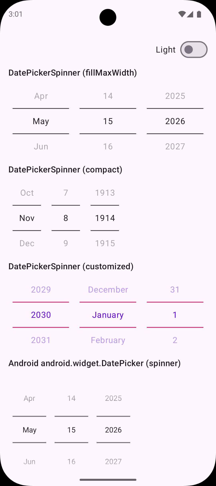
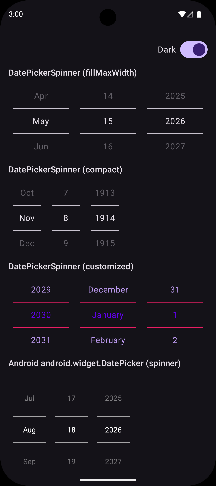

# DatePickerSpinner

The missing DatePickerSpinner from Material Design

[](https://central.sonatype.com/artifact/com.commit451/datepickerspinner)

|           Light            |           Dark           |
|:--------------------------:|:------------------------:|
|  |  |

## Supported Platforms

- Android
- JVM (Desktop)
- iOS (arm64, simulator arm64)
- Web (Wasm, JS)

## Gradle

### Multiplatform

For Compose Multiplatform projects, add the dependency in your `commonMain` source set:

```kotlin
commonMain.dependencies {
    implementation("com.commit451:datepickerspinner:latest.release.here")
}
```

### Android

For Android-only projects:

```kotlin
dependencies {
    implementation("com.commit451:datepickerspinner-android:latest.release.here")
}
```

### JVM (Desktop)

For JVM-only projects:

```kotlin
dependencies {
    implementation("com.commit451:datepickerspinner-jvm:latest.release.here")
}
```

### Web/iOS

Web (Wasm and JS) and iOS have no standalone artifacts — both come through a Compose
Multiplatform module. Use the `commonMain` dependency from the Multiplatform section above;
Gradle resolves the correct variant for each target your project declares.

## Basic Usage

```kotlin
val state = rememberDatePickerSpinnerState()

DatePickerSpinner(
    state = state,
    modifier = Modifier.fillMaxWidth(),
)

// The selection is observable from composition at any time:
val selected: LocalDate = state.selectedDate
```

By default the picker opens on today's date with a `1900..2100` year range. Pass `initialDate`
and `yearRange` to `rememberDatePickerSpinnerState` to change that. With no width modifier the
picker is compact; give it `Modifier.fillMaxWidth()` (or any fixed width) and the wheels stretch
to share it.

## Customization

Colors are overridable per-instance via `colors`:

```kotlin
DatePickerSpinner(
    state = rememberDatePickerSpinnerState(),
    colors = DatePickerSpinnerDefaults.colors(
        dividerColor = MaterialTheme.colorScheme.primary,
    ),
)
```

Text styling follows `MaterialTheme.typography.bodyLarge`, like Material 3's `DatePicker`. To
restyle it, override that role in the theme — app-wide, or scoped around the picker:

```kotlin
MaterialTheme(
    typography = MaterialTheme.typography.copy(
        bodyLarge = MaterialTheme.typography.bodyLarge.copy(fontSize = 20.sp),
    ),
) {
    DatePickerSpinner(state = rememberDatePickerSpinnerState())
}
```

## Localization

The library bundles no strings. Localize it by supplying a `dateFormatter` with your own month
labels and, if needed, a wheel order matching the locale's date order:

```kotlin
DatePickerSpinner(
    state = rememberDatePickerSpinnerState(),
    dateFormatter = DatePickerSpinnerDefaults.dateFormatter(
        monthNames = localizedMonthNames, // any 12-element list, January-first
        fieldOrder = listOf(DateField.Day, DateField.Month, DateField.Year),
    ),
)
```

For full control — localized numerals, era suffixes, day-of-week, etc. — implement
`DatePickerSpinnerFormatter` directly.

## License

DatePickerSpinner is available under the MIT license. See the LICENSE file for more info.

\ ゜o゜)ノ
